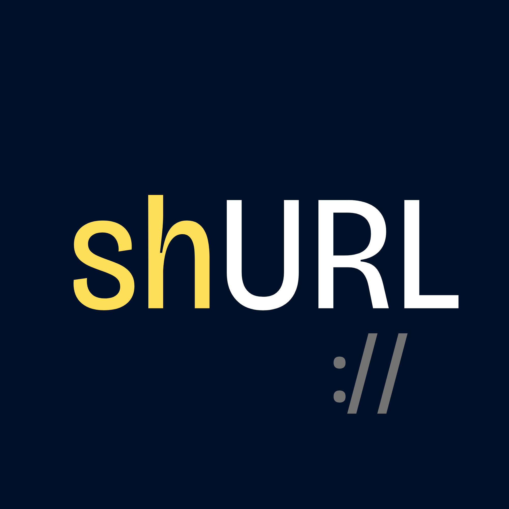

  <picture>
    
  </picture>
  <h1>shurl — URL Shortener</h1>
  

    A lightweight URL shortener built with Go's standard library.
  

  

    <a href="#features">Features</a> ·
    <a href="#architecture">Architecture</a> ·
    <a href="#tech-stack">Tech Stack</a> ·
    <a href="#quick-start">Quick Start</a> ·
    <a href="#project-structure">Structure</a>
  

## Features

## Architecture

## Tech Stack

## Quick Start

## Project Structure

